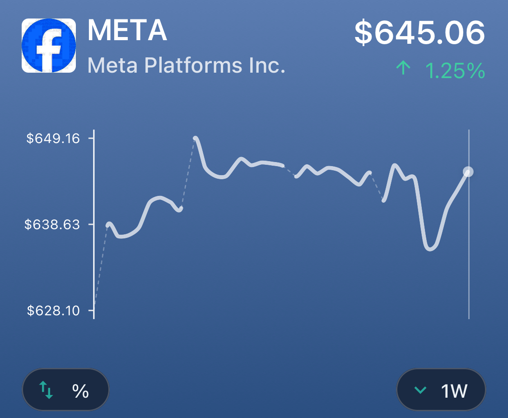
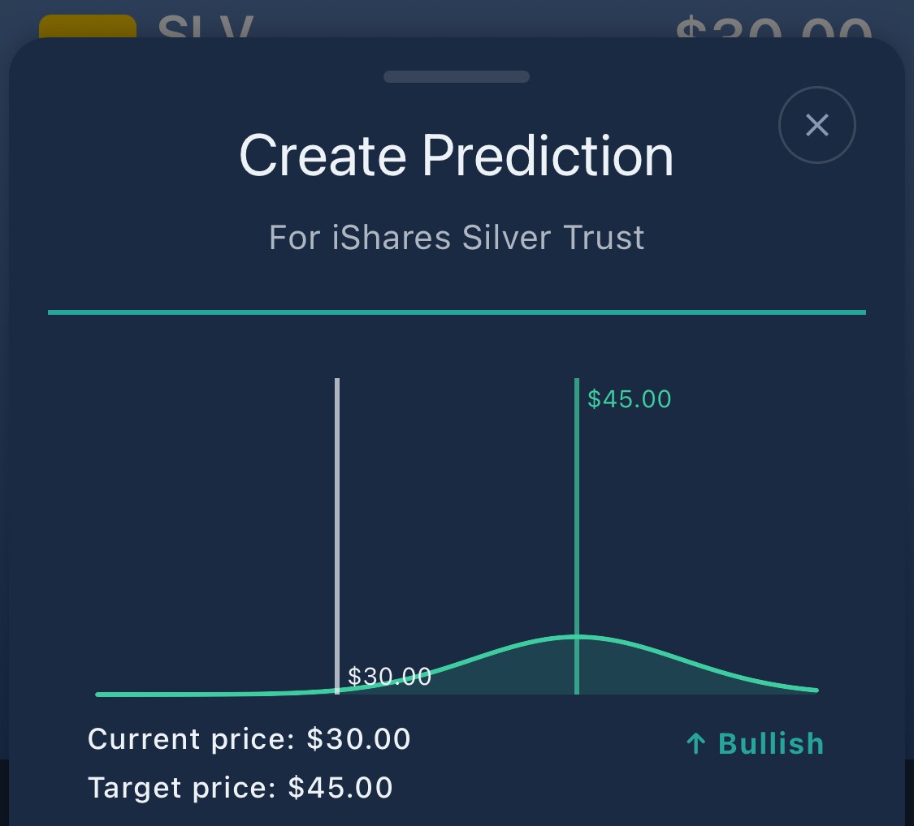

# React Native Ballast Charts

A high-performance, interactive chart library for React Native with advanced gap handling and financial data visualization.

[](https://www.npmjs.com/package/react-native-ballast-charts)
[](https://www.npmjs.com/package/react-native-ballast-charts)
[](https://www.typescriptlang.org/)
[](https://reactnative.dev/)
[](https://opensource.org/licenses/MIT)

## Features

- 📊 **Interactive Charts**: Touch-responsive charts with crosshair and tooltip support
- 🎯 **High Performance**: Optimized for 60fps with React Native Reanimated worklets
- 📈 **Smooth Curves**: Multiple smoothing algorithms (Bézier, Catmull-Rom, Cardinal)
- ⏸️ **Advanced Gap Handling**: Both proportional and fixed-width gap visualization
- 🎨 **Customizable Styling**: Comprehensive theming and styling options
- 📱 **React Native Optimized**: Built specifically for mobile performance

## Screenshots

| Line Chart | Distribution Chart |
|------------|-------------------|
|  |  |
| Interactive stock price chart with smooth curves and gap handling | Distribution visualization with optimized padding |

## Installation

```bash
npm install react-native-ballast-charts
```

### Peer Dependencies

This library requires the following peer dependencies:

```bash
npm install react-native-reanimated react-native-gesture-handler react-native-svg
```

Follow the installation guides for each:
- [React Native Reanimated](https://docs.swmansion.com/react-native-reanimated/docs/fundamentals/installation)
- [React Native Gesture Handler](https://docs.swmansion.com/react-native-gesture-handler/docs/installation)
- [React Native SVG](https://github.com/software-mansion/react-native-svg#installation)


## Quick Start

```tsx
import { Chart } from 'react-native-ballast-charts';

const MyChart = () => {
  const data = {
    x: [1640995200000, 1641081600000, 1641168000000], // timestamps
    y: [100, 120, 110] // values
  };

  return (
    <Chart
      data={data}
      width={300}
      height={200}
      lineStyle={{
        color: '#007AFF',
        width: 2,
        smoothing: 'bezier'
      }}
    />
  );
};
```

## Gap Handling

This library provides sophisticated gap handling for time series data with missing periods.

### Gap Detection

Gaps are automatically detected when the time interval between consecutive data points exceeds a threshold:

```tsx
<Chart
  data={data}
  gaps={{
    enabled: true,
    threshold: 2.5 // Gap detected when interval > 2.5x median interval
  }}
/>
```

### Proportional Gaps (Default)

By default, gaps are rendered proportionally to their time duration:

```tsx
<Chart
  data={data}
  gaps={{
    enabled: true,
    threshold: 2.5,
    style: {
      color: '#999',
      width: 1,
      dashArray: '4 4'
    }
  }}
/>
```

**Behavior**: A 1-week gap will appear larger than a 1-day gap, proportional to their time difference.

### Fixed Width Gaps

For consistent visual representation regardless of gap duration:

```tsx
<Chart
  data={data}
  gaps={{
    enabled: true,
    threshold: 2.5,
    fixedWidthGaps: true,
    fixedWidth: 40, // All gaps appear as exactly 40px
    style: {
      color: '#999',
      width: 1,
      dashArray: '2 3'
    }
  }}
/>
```

**Behavior**: All gaps appear as the same visual width (40px by default), regardless of their actual time duration.

#### How Fixed Width Gaps Work

1. **Gap Detection**: Identifies time periods where data is missing
2. **Segment Division**: Divides the timeline into continuous data segments separated by gaps
3. **Consistent Scaling**: Applies uniform time-to-pixel scaling across all segments
4. **Fixed Gap Insertion**: Inserts exactly `fixedWidth` pixels between segments

**Example**: With a 1-week dataset containing weekend gaps:
- **Proportional**: Weekend gaps appear larger than weekday gaps
- **Fixed Width**: All gaps appear identical (e.g., 40px), maintaining visual consistency

#### When to Use Fixed Width Gaps

- **Financial Charts**: Trading hours vs. market closures
- **Business Metrics**: Weekdays vs. weekends  
- **Sensor Data**: Regular maintenance periods
- **Any scenario** where gap duration shouldn't distort visual analysis

### Gap Configuration Options

```tsx
interface GapConfig {
  enabled: boolean;                    // Enable gap detection
  threshold?: number;                  // Gap threshold multiplier (default: 2.0)
  fixedWidthGaps?: boolean;           // Use fixed width gaps
  fixedWidth?: number;                // Fixed gap width in pixels (default: 40)
  style?: {
    color?: string;                   // Gap indicator color
    width?: number;                   // Gap indicator line width
    dashArray?: string;               // Dash pattern (e.g., "4 4", "2 3")
  };
}
```

## Chart Props

### Core Props

```tsx
interface ChartProps {
  data: ChartData;                    // Chart data
  width: number;                      // Chart width
  height: number;                     // Chart height
  padding?: Padding;                  // Chart padding
  style?: ViewStyle;                  // Container styling
}

interface ChartData {
  x: number[];                        // X-axis data (usually timestamps)
  y: number[];                        // Y-axis data (values)
}
```

### Styling Props

```tsx
interface LineStyle {
  color?: string;                     // Line color
  width?: number;                     // Line width
  opacity?: number;                   // Line opacity
  smoothing?: 'none' | 'bezier' | 'catmull-rom' | 'cardinal';
  tension?: number;                   // Curve tension (0-1)
}

interface FillStyle {
  enabled?: boolean;                  // Enable area fill
  color?: string;                     // Fill color
  opacity?: number;                   // Fill opacity
}
```

### Interaction Props

```tsx
interface InteractionConfig {
  enabled?: boolean;                  // Enable touch interactions
  onDrag?: (x: number, y: number, index: number) => void;
  onDragStart?: (x: number, y: number, index: number) => void;
  onDragEnd?: (x: number, y: number, index: number) => void;
  onTap?: (x: number, y: number, index: number) => void;
  dragLineStyle?: LineStyle;          // Crosshair styling
}
```

### Complete Example

```tsx
<Chart
  data={{ x: timestamps, y: prices }}
  width={350}
  height={200}
  padding={{ top: 20, right: 20, bottom: 40, left: 60 }}
  
  lineStyle={{
    color: '#007AFF',
    width: 2,
    opacity: 1,
    smoothing: 'bezier',
    tension: 0.3
  }}
  
  fillStyle={{
    enabled: true,
    color: '#007AFF',
    opacity: 0.1
  }}
  
  gaps={{
    enabled: true,
    threshold: 2.5,
    fixedWidthGaps: true,
    fixedWidth: 40,
    style: {
      color: '#999',
      width: 1,
      dashArray: '2 3'
    }
  }}
  
  interaction={{
    enabled: true,
    onDrag: (x, y, index) => {
      console.log('Dragging:', { x, y, index });
    },
    dragLineStyle: {
      color: '#FF3B30',
      width: 1,
      opacity: 0.8
    }
  }}
  
  axes={{
    x: {
      show: true,
      style: { lineColor: '#E5E5E7', labelStyle: { color: '#8E8E93' } }
    },
    y: {
      show: true,
      style: { lineColor: '#E5E5E7', labelStyle: { color: '#8E8E93' } }
    }
  }}
/>
```

## Performance Considerations

- **Worklet Optimization**: Touch interactions run on the UI thread for 60fps performance
- **Data Scaling**: Coordinate calculations are memoized and optimized
- **SVG Rendering**: Efficient path generation with minimal DOM updates
- **Memory Management**: Automatic cleanup of gesture handlers and animations

## TypeScript Support

The library is fully typed with comprehensive TypeScript definitions. All props, configs, and callback signatures include complete type information.

## Migration Notes

### From Proportional to Fixed Width Gaps

```tsx
// Before (proportional gaps)
gaps={{ enabled: true, threshold: 2.5 }}

// After (fixed width gaps)
gaps={{ 
  enabled: true, 
  threshold: 2.5,
  fixedWidthGaps: true,
  fixedWidth: 40 
}}
```

### Breaking Changes

None. Fixed width gaps are an additive feature that doesn't affect existing implementations.

## Troubleshooting

### Gaps Not Appearing
- Verify `gaps.enabled: true`
- Check that `threshold` value is appropriate for your data intervals
- Ensure data actually contains time gaps (missing periods)

### Unexpected Gap Sizes
- **Proportional gaps**: Gap size reflects actual time duration
- **Fixed width gaps**: All gaps appear as `fixedWidth` pixels regardless of duration

### Performance Issues
- Reduce data point density for large datasets
- Consider data downsampling for initial render
- Use `React.memo` for chart container components

## Contributing

This library is part of the Ballast investment application. For contributions or issues, please follow the project's standard development workflow.
